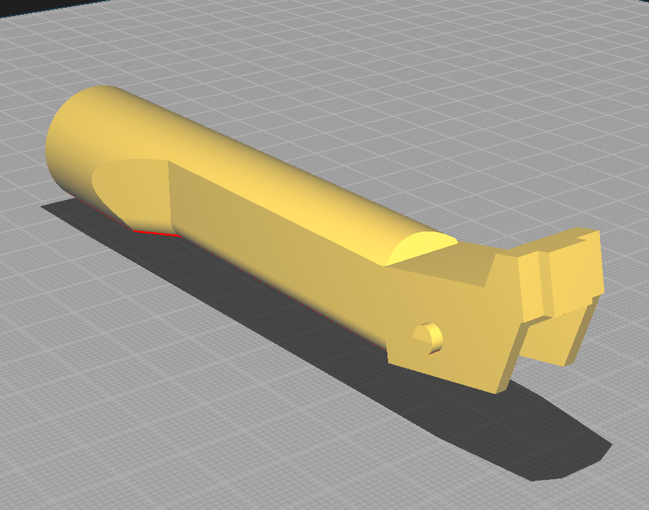
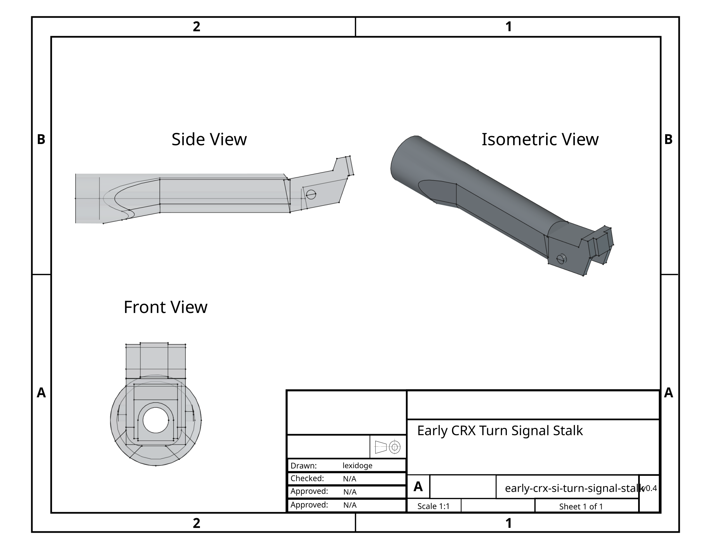
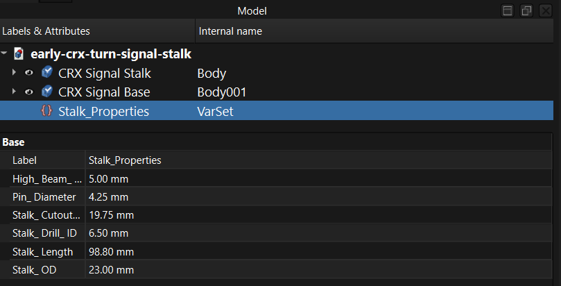

# Early-Model CRX Turn Signal Stalk
Repository containing FreeCAD project and STL models for an early-model Honda CRX Si turn signal stalk. 

Confirmed to fit 1986 model year.

This project was created in FreeCAD 1.1.3 and is incompatible with older versions.

## Technical Drawing

## Project Structure
This FreeCAD project is split into two independent bodies, placed appropriately in free space to create the final model.
Yes, this is terrible.

The design is semi-parameterized via a VarSet object, making important adjustments fairly easy to make.

